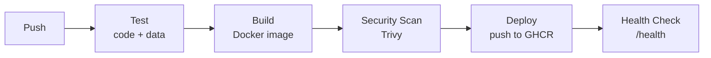

# DataGuard: Automated CI/CD Pipeline for a Containerized CSV Data Quality Service

DataGuard is a containerized service that validates, cleans and analyzes CSV data so raw files become reliable, analysis-ready datasets. It checks for missing values, duplicates, type mismatches and formatting errors, cleans the data, and generates summary insights. The service is packaged with Docker so it runs the same way everywhere. A GitHub Actions CI/CD pipeline automatically tests, builds, scans and deploys every code change. The pipeline also runs data-quality regression tests and container security scans before every deployment.

## Tech Stack

| Layer | Tool |
|---|---|
| Application | Python 3.12, Flask, pandas, Gunicorn |
| Testing | pytest (unit tests + golden-file data-quality tests) |
| Containerization | Docker (multi-stage, non-root, HEALTHCHECK) |
| CI/CD | GitHub Actions |
| Security | Trivy container vulnerability scanning |
| Registry | GitHub Container Registry (GHCR) |

## Project Structure

```
.
├── app/
│   ├── main.py               # Flask API: /, /health, /validate, /clean, /analyze
│   └── data_quality.py       # validate(), clean(), analyze()
├── tests/
│   ├── data/
│   │   ├── clean_sample.csv      # valid input, must pass validation
│   │   ├── messy_sample.csv      # dirty input, must be flagged
│   │   └── expected_cleaned.csv  # golden output of clean(messy_sample.csv)
│   ├── test_app.py           # API + unit tests
│   └── test_golden_data.py   # data-quality regression tests
├── .github/workflows/ci-cd.yml
├── Dockerfile                # production multi-stage image
├── Dockerfile.baseline       # naive single-stage image (for size comparison only)
├── requirements.txt          # runtime dependencies
└── requirements-dev.txt      # runtime + test dependencies
```

## Expected CSV Schema

`id, name, email, age, signup_date, salary`

**Validation checks:** missing columns, missing values, extra whitespace, duplicate rows, duplicate IDs, non-numeric `id`/`age`/`salary`, out-of-range age (0–120), invalid email format, and dates not in `YYYY-MM-DD` format.

**Cleaning rules:**
- Trims whitespace, converts names to title case and emails to lowercase.
- Parses dates in several common formats and rewrites them as `YYYY-MM-DD`.
- Strips `$` and `,` from salaries.
- Drops rows with no ID, an invalid email or an unparseable date.
- Removes duplicate rows and duplicate IDs, keeping the first.
- Fills a missing or invalid age or salary with the column median, and a missing name with `Unknown`.

## API

| Method | Endpoint | Description |
|---|---|---|
| GET | `/` | Service info |
| GET | `/health` | Returns `{"status": "ok", "service": "dataguard"}` |
| POST | `/validate` | Returns a JSON data-quality report |
| POST | `/clean` | Returns the cleaned CSV |
| POST | `/analyze` | Cleans the data, then returns summary statistics |

POST endpoints accept a multipart upload named `file` or a raw CSV body.

```bash
curl -F file=@tests/data/messy_sample.csv http://localhost:5000/validate
curl -F file=@tests/data/messy_sample.csv http://localhost:5000/clean
curl -F file=@tests/data/messy_sample.csv http://localhost:5000/analyze
```

## Run Locally

```bash
python3 -m venv .venv && source .venv/bin/activate
pip install -r requirements-dev.txt
pytest -v                      # run all tests
python -m app.main             # dev server on http://localhost:5000
```

## Run with Docker

```bash
docker build -t dataguard .
docker run -d -p 5000:5000 --name dataguard dataguard
curl http://localhost:5000/health
```

## Pipeline

Every push to `main` runs the full pipeline. Pull requests run everything except the push to the registry.



```
Push → Test (code + data) → Build → Security Scan → Deploy → Health Check
```

| Stage | Workflow step | Fails the pipeline when… |
|---|---|---|
| Test | `Unit Tests`, `Data Quality Tests` | any pytest test fails, including a change in cleaning output vs. `expected_cleaned.csv` |
| Build | `Build Docker Image` | the image does not build |
| Security Scan | `Security Scan (Trivy)` | a fixable CRITICAL vulnerability is found |
| Deploy | `Deploy (Push Image to GHCR)` | the push to `ghcr.io/<owner>/dataguard` fails |
| Health Check | `Post-Deploy Health Check` | the published image does not answer `/health` within 10 tries, 3 seconds apart |

The deploy step uses the built-in `GITHUB_TOKEN`, so no extra secrets are needed.

## Docker Image Optimization

Both images were built from the same source with the same `.dockerignore`, and measured with `docker images`.

| Image | Base | Build | User | Size |
|---|---|---|---|---|
| Before (`Dockerfile.baseline`) | `python:3.12` | single-stage, includes test deps | root | **1.32 GB** |
| After (`Dockerfile`) | `python:3.12-slim` | multi-stage: venv built in builder, only venv + `app/` copied | `appuser` | **304 MB** |

That's a **~77% smaller** image. The final image also runs as a non-root user, has a `HEALTHCHECK` against `/health`, and a local Trivy scan found 0 fixable CRITICAL vulnerabilities.

## Future Scope

- **Monitoring:** expose Prometheus metrics and build Grafana dashboards for request rate, latency and data-quality issue counts.
- **Blue-green deployment with auto-rollback:** route traffic to the new version only after its health check passes, and roll back automatically if it fails.
- **Schema-as-code data contracts:** define the expected schema in a versioned file (for example, JSON Schema or Great Expectations) instead of hard-coding it.
- **Terraform IaC:** provision the hosting environment and registry reproducibly with Terraform.
- **Large-file streaming with a job queue:** process large CSVs in chunks as background jobs (for example, Celery or RQ with Redis) instead of in the request.
